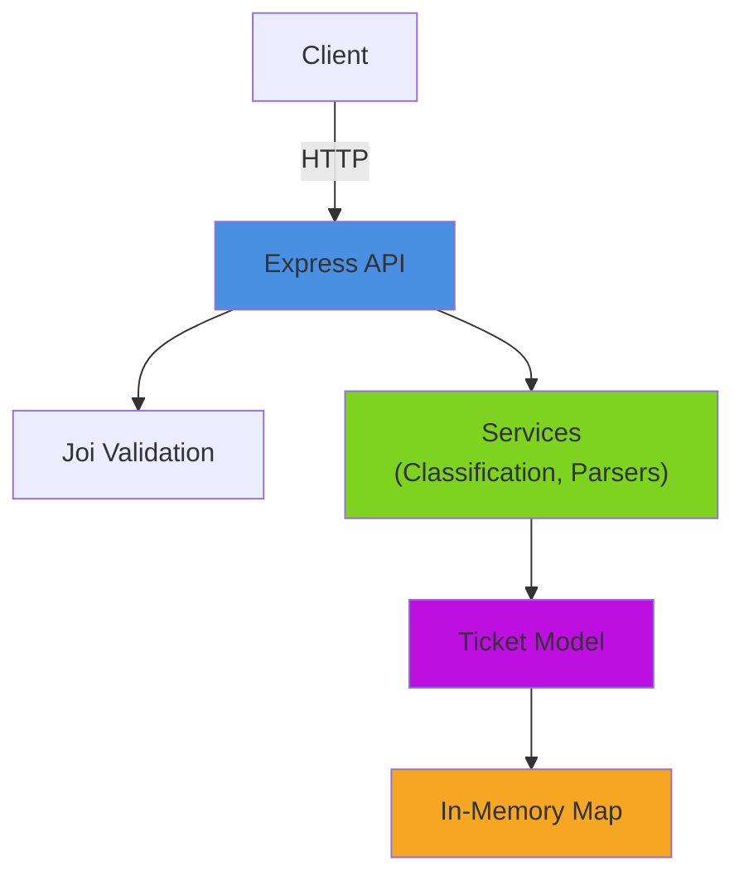

# 🎧 Intelligent Customer Support System

> **Author:** Andrii Orel  
> **Course:** AI as a Personalized Coding Partner  
> **Homework:** #2 - Multi-Format Ticket Import with Auto-Classification

A Node.js/Express application for managing customer support tickets with multi-format import (CSV/JSON/XML), automatic categorization, and intelligent priority assignment.

---

## ✨ Features

- 🎯 **Multi-Format Import** - CSV, JSON, XML file parsing
- 🤖 **Auto-Classification** - Keyword-based categorization with confidence scores
- 📊 **RESTful API** - Complete CRUD operations
- 🔍 **Advanced Filtering** - Category, priority, status, customer, search
- ✅ **Input Validation** - Joi schema validation
- ⚡ **In-Memory Storage** - Fast Map-based data store
- 📈 **89% Test Coverage** - Comprehensive test suite

---

## 🚀 Quick Start

### Prerequisites
- Node.js >= 16.x
- npm >= 8.x

### Installation & Running

```bash
# Navigate to homework-2
cd homework-2

# Install dependencies
npm install

# Start server
npm start

# Development mode (auto-reload)
npm run dev
```

Server runs at: `http://localhost:3000`

---

## 📚 Project Structure

```
homework-2/
├── src/
│   ├── index.js                 # Express app
│   ├── models/ticket.js         # In-memory model
│   ├── routes/tickets.js        # API endpoints
│   ├── services/classificationService.js  # Auto-classification
│   ├── parsers/                 # CSV/JSON/XML parsers
│   └── validators/ticketValidator.js  # Joi validation
├── tests/
│   ├── test_*.test.js           # Test suites (67 tests)
│   └── fixtures/                # Sample data files
├── docs/
│   ├── API_REFERENCE.md         # Complete API docs
│   ├── ARCHITECTURE.md          # System design
│   ├── TESTING_GUIDE.md         # QA guide
│   └── screenshots/             # Documentation screenshots
└── package.json
```

---

## 📖 API Endpoints

| Method | Endpoint | Description |
|--------|----------|-------------|
| `POST` | `/tickets` | Create ticket |
| `GET` | `/tickets` | List tickets (with filters) |
| `GET` | `/tickets/:id` | Get ticket by ID |
| `PUT` | `/tickets/:id` | Update ticket |
| `DELETE` | `/tickets/:id` | Delete ticket |
| `POST` | `/tickets/import` | Bulk import (CSV/JSON/XML) |
| `POST` | `/tickets/:id/auto-classify` | Trigger auto-classification |

**Examples:**
```bash
# Create ticket
curl -X POST http://localhost:3000/tickets \
  -H "Content-Type: application/json" \
  -d '{"customer_id":"CUST-001","customer_email":"john@example.com","customer_name":"John Doe","subject":"Cannot login","description":"Locked out after failed attempts","status":"new"}'

# List urgent tickets
curl -X GET "http://localhost:3000/tickets?priority=urgent"

# Import CSV
curl -X POST http://localhost:3000/tickets/import \
  -H "Content-Type: text/csv" \
  --data-binary @tests/fixtures/sample_tickets.csv
```

See [API_REFERENCE.md](docs/API_REFERENCE.md) for complete documentation.

---

## 🤖 Classification System

**Categories:**
- `account_access` - Login, password, 2FA issues
- `technical_issue` - Bugs, errors, crashes
- `billing_question` - Payments, invoices, refunds
- `feature_request` - Enhancement suggestions
- `bug_report` - Defects with reproduction steps
- `other` - Uncategorizable issues

**Priorities:**
- `urgent` - Production issues, security concerns
- `high` - Blocking issues, time-sensitive
- `medium` - Standard issues (default)
- `low` - Minor issues, suggestions

Each classification includes:
- Confidence scores (0-1)
- Matched keywords
- Reasoning explanation

---

## 🧪 Testing

```bash
# Run all tests (67 tests)
npm test

# Coverage report (89%)
npm run test:coverage

# Watch mode
npm run test:watch
```

### Test Coverage

| Module | Coverage |
|--------|----------|
| Models | 97% |
| Services | 98% |
| Validators | 100% |
| Routes | 95% |
| **Overall** | **89%** |

**Test Categories:**
- API Tests: 11 tests
- Model Tests: 9 tests
- Classification Tests: 10 tests
- Import Tests: 16 tests (CSV/JSON/XML)
- Integration Tests: 5 tests
- Performance Tests: 5 tests

See [TESTING_GUIDE.md](docs/TESTING_GUIDE.md) for details.

---

## 🏗️ Architecture



**Key Design Decisions:**
- **In-Memory Storage**: Fast O(1) lookups, ideal for dev/testing
- **Keyword-Based Classification**: No ML dependencies, deterministic results
- **Joi Validation**: Industry standard, comprehensive error messages
- **Separate Parsers**: Easy to extend with new formats

See [ARCHITECTURE.md](docs/ARCHITECTURE.md) for deep dive.

---

## 🔧 Technology Stack

| Layer | Technology |
|-------|-----------|
| Runtime | Node.js 16+ |
| Framework | Express.js 5.x |
| Validation | Joi |
| CSV Parsing | csv-parse |
| XML Parsing | xml2js |
| Testing | Jest + Supertest |
| Storage | In-Memory Map |

---

## 📊 Performance

| Operation | Duration |
|-----------|----------|
| Create ticket | <5ms |
| Bulk import (100 tickets) | ~50ms |
| List/filter tickets | <1ms |
| Auto-classification | <2ms |

---

## 📦 Sample Data

Located in `tests/fixtures/`:
- `sample_tickets.csv` - 50 tickets
- `sample_tickets.json` - 20 tickets
- `sample_tickets.xml` - 30 tickets
- `invalid_tickets.*` - Test invalid data

---

## 🛠️ Development

### Recommended Setup
```bash
# Install dev dependencies
npm install --save-dev eslint prettier

# Create .eslintrc.json
npx eslint --init

# Run linter
npx eslint src/
```

### Environment Variables
```bash
# Optional: Change port (default: 3000)
export PORT=3001
npm start
```

---

## 📝 Documentation

- [API_REFERENCE.md](docs/API_REFERENCE.md) - Complete API documentation
- [ARCHITECTURE.md](docs/ARCHITECTURE.md) - System design & architecture
- [TESTING_GUIDE.md](docs/TESTING_GUIDE.md) - Testing guide for QA

---

## 🤖 AI Tools Used

- **GitHub Copilot** - Code generation, test writing
- **Claude Code** - Architecture planning, documentation
- **Context7** - API design patterns, best practices

---

## 📸 Screenshots

- [Clarification](docs/screenshots/clarification.png) - AI interaction for requirements
- [Plan](docs/screenshots/plan.png) - Implementation planning
- [Test Coverage](docs/screenshots/test_coverage.png) - 89% coverage report

---

## 📄 License

ISC

---

<div align="center">

**Created with AI assistance as part of AI Coding Partner course**  
*Last Updated: February 2026*

</div>

