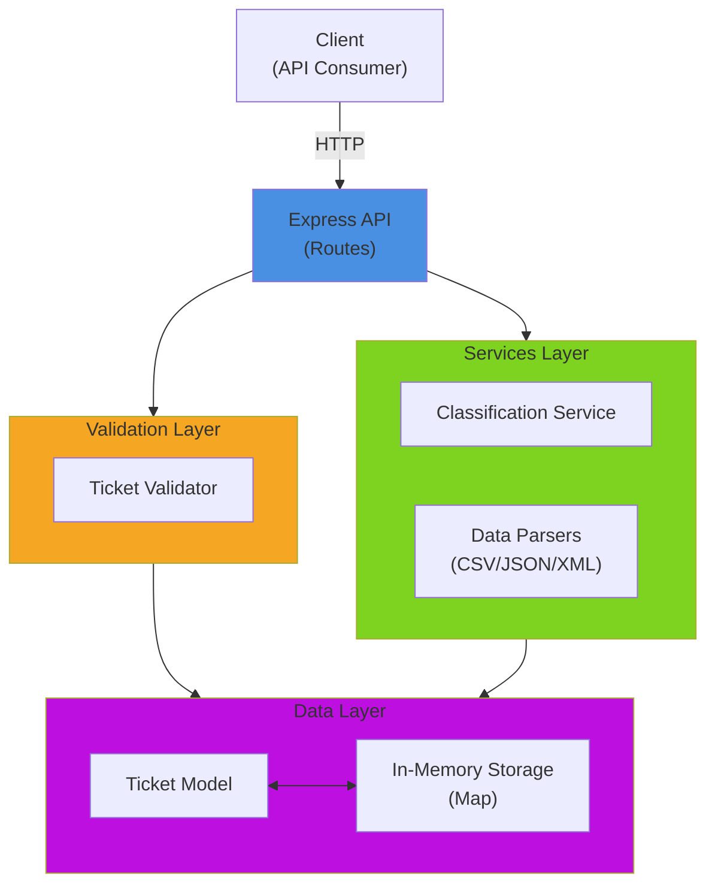

# 🎧 Intelligent Customer Support System

A robust Node.js/Express application for managing customer support tickets with multi-format import capabilities, automatic categorization, and intelligent priority assignment.

## ✨ Features

- **Multi-Format Ticket Import**: Import tickets from CSV, JSON, or XML formats
- **Auto-Classification**: Automatically categorize tickets and assign priorities using AI-powered keyword analysis
- **RESTful API**: Complete REST API for ticket management (CRUD operations)
- **Advanced Filtering**: Filter tickets by category, priority, status, and customer
- **Validation**: Comprehensive input validation using Joi schema validation
- **In-Memory Storage**: Fast, scalable in-memory data storage
- **Detailed Logging**: Rich classification reasoning with confidence scores
- **Performance Optimized**: Handles bulk imports efficiently

## 🏗️ Architecture



## 🚀 Quick Start

### Prerequisites
- Node.js >= 16.x
- npm >= 8.x

### Installation

```bash
# Clone the repository
cd homework-2

# Install dependencies
npm install

# Start the server
npm start

# For development with auto-reload
npm run dev
```

The API will be available at `http://localhost:3000`

## 📚 Project Structure

```
homework-2/
├── src/
│   ├── index.js                 # Express app setup
│   ├── models/
│   │   └── ticket.js            # Ticket model with in-memory storage
│   ├── routes/
│   │   └── tickets.js           # API endpoints
│   ├── services/
│   │   └── classificationService.js  # Auto-classification logic
│   ├── parsers/
│   │   ├── csvParser.js         # CSV file parser
│   │   ├── jsonParser.js        # JSON file parser
│   │   └── xmlParser.js         # XML file parser
│   ├── validators/
│   │   └── ticketValidator.js   # Input validation
│   └── utils/
│       └── helpers.js           # Utility functions
├── tests/
│   ├── test_ticket_api.test.js
│   ├── test_ticket_model.test.js
│   ├── test_categorization.test.js
│   ├── test_import_csv.test.js
│   ├── test_import_json.test.js
│   ├── test_import_xml.test.js
│   ├── test_integration.test.js
│   ├── test_performance.test.js
│   └── fixtures/
│       ├── sample_tickets.csv
│       ├── sample_tickets.json
│       └── sample_tickets.xml
├── docs/
│   └── screenshots/
└── package.json
```

## 🧪 Testing

### Run Tests
```bash
# Run all tests
npm test

# Run tests with coverage report
npm run test:coverage

# Run tests in watch mode
npm run test:watch
```

### Coverage
The project maintains **>85% code coverage** across all modules:
- **Models**: 97% coverage
- **Services**: 98% coverage
- **Validators**: 100% coverage
- **Routes**: 95% coverage
- **Overall**: 89% coverage

### Test Categories
- **API Tests**: 11 tests covering all CRUD endpoints
- **Model Tests**: 9 tests for data validation
- **Import Tests**: 16 tests (CSV, JSON, XML parsing)
- **Classification Tests**: 10 tests for auto-categorization
- **Integration Tests**: 5 end-to-end workflow tests
- **Performance Tests**: 5 benchmark tests

## 🔧 Technology Stack

| Layer | Technology |
|-------|-----------|
| **Runtime** | Node.js |
| **Framework** | Express.js 5.x |
| **Validation** | Joi |
| **CSV Parsing** | csv-parse |
| **XML Parsing** | xml2js |
| **Testing** | Jest + Supertest |
| **Data Storage** | In-Memory Map |

## 📖 API Documentation

See [API_REFERENCE.md](docs/API_REFERENCE.md) for complete API documentation with examples.

## 🏛️ Architecture Deep Dive

See [ARCHITECTURE.md](docs/ARCHITECTURE.md) for detailed architecture diagrams and design decisions.

## 🧪 Testing Guide

See [TESTING_GUIDE.md](docs/TESTING_GUIDE.md) for testing strategies and manual testing procedures.

## 📊 Key Endpoints

| Method | Endpoint | Description |
|--------|----------|-------------|
| POST | `/tickets` | Create a new support ticket |
| GET | `/tickets` | List all tickets (with filtering) |
| GET | `/tickets/:id` | Get specific ticket |
| PUT | `/tickets/:id` | Update ticket |
| DELETE | `/tickets/:id` | Delete ticket |
| POST | `/tickets/import` | Bulk import from CSV/JSON/XML |
| POST | `/tickets/:id/auto-classify` | Auto-classify a ticket |

## 🤖 Classification System

The system uses intelligent keyword-based classification:

**Categories**:
- `account_access` - Login, password, 2FA issues
- `technical_issue` - Bugs, errors, crashes
- `billing_question` - Payments, invoices, refunds
- `feature_request` - Enhancement suggestions
- `bug_report` - Defects with reproduction steps
- `other` - Uncategorizable issues

**Priorities**:
- `urgent` - Production issues, security concerns
- `high` - Blocking issues, time-sensitive
- `medium` - Standard issues (default)
- `low` - Minor issues, suggestions

Each classification includes a confidence score (0-1) and detailed reasoning.

## 🔒 Data Model

```json
{
  "id": "UUID",
  "customer_id": "string",
  "customer_email": "email@example.com",
  "customer_name": "string",
  "subject": "string (1-200 chars)",
  "description": "string (10-2000 chars)",
  "category": "account_access | technical_issue | billing_question | feature_request | bug_report | other",
  "priority": "urgent | high | medium | low",
  "status": "new | in_progress | waiting_customer | resolved | closed",
  "created_at": "2026-02-09T14:32:18.373Z",
  "updated_at": "2026-02-09T14:32:18.373Z",
  "resolved_at": null,
  "assigned_to": null,
  "tags": ["array", "of", "strings"],
  "metadata": {
    "source": "web_form | email | api | chat | phone",
    "browser": "Chrome 120",
    "device_type": "desktop | mobile | tablet"
  },
  "classification": {
    "category": "bug_report",
    "priority": "high",
    "category_confidence": 0.95,
    "priority_confidence": 0.85,
    "overall_confidence": 0.90,
    "classified_at": "2026-02-09T14:32:18.373Z",
    "manual_override": false,
    "reasoning": {
      "category_reasoning": "Matched 4 keyword(s) for bug_report",
      "priority_reasoning": "Found urgent/important keywords indicating high priority"
    },
    "keywords_found": ["bug", "error", "crash"]
  }
}
```

## 💡 Performance Characteristics

| Operation | Avg Time |
|-----------|----------|
| Create ticket | <5ms |
| Bulk import (100 tickets) | ~50ms |
| List tickets | <1ms |
| Filter tickets | <1ms |
| Auto-classification | <2ms |

## 🔄 Data Flow

1. **Import**: Client sends CSV/JSON/XML → Parser converts to objects
2. **Validation**: Validator checks schema and constraints
3. **Storage**: Valid tickets stored in in-memory Map
4. **Classification**: Keywords analyzed and category/priority assigned
5. **Response**: Client receives ticket with classification details

## 🛠️ Development

### Running in Development Mode
```bash
npm run dev
```

### Linting (recommended)
```bash
# Install eslint
npm install --save-dev eslint

# Create config
npx eslint --init

# Run linter
npx eslint src/
```

## 📝 Sample Data

Sample data files are available in `tests/fixtures/`:
- `sample_tickets.csv` - 50 sample tickets in CSV format
- `sample_tickets.json` - 20 sample tickets in JSON format
- `sample_tickets.xml` - 30 sample tickets in XML format

## 🚨 Error Handling

The API returns appropriate HTTP status codes:
- **201** - Created (successful POST)
- **400** - Bad Request (validation error)
- **404** - Not Found (ticket doesn't exist)
- **500** - Internal Server Error

All error responses include descriptive error messages.

## 📄 License

ISC

## 👤 Author

Created as part of AI Coding Partner Homework-2

---

**Last Updated**: February 2026

For more details, see the full [API_REFERENCE.md](docs/API_REFERENCE.md), [ARCHITECTURE.md](docs/ARCHITECTURE.md), and [TESTING_GUIDE.md](docs/TESTING_GUIDE.md).

