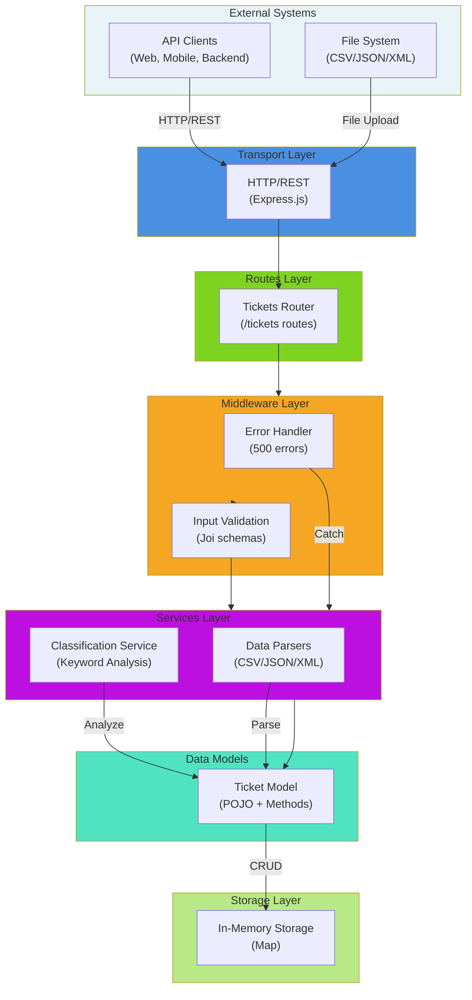
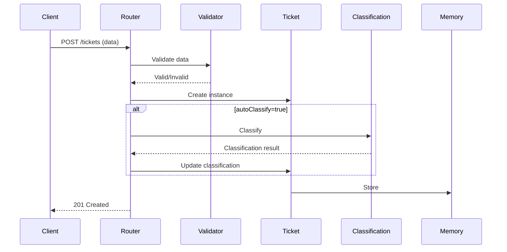
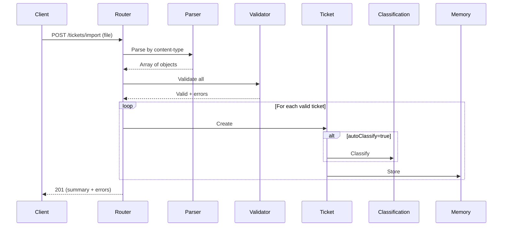
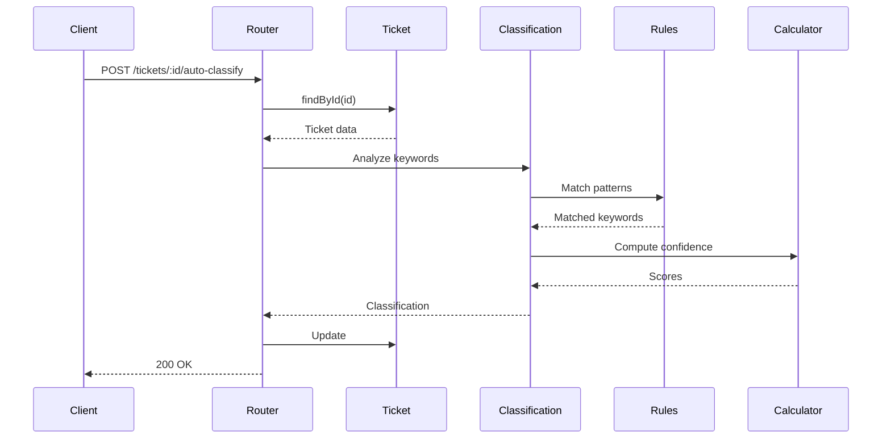

# 🏛️ Architecture Documentation

System architecture and design decisions for the Intelligent Customer Support System.

## System Overview



## Components

### 1. Transport Layer (`src/index.js`)
Express.js HTTP server handling:
- Request/response parsing
- Routing configuration
- Global error handling
- Health check endpoint

### 2. Routes Layer (`src/routes/tickets.js`)
REST API endpoints:
- CRUD operations on tickets
- Bulk import with format detection
- Auto-classification trigger
- Query filtering and pagination

### 3. Validation Layer (`src/validators/ticketValidator.js`)
Joi schema validation:
- Required field validation (customer_id, email, name, subject, description)
- Email format checking
- String length constraints (subject: 1-200, description: 10-2000)
- Enum validation (category, priority, status)
- Batch validation with error collection

### 4. Parsers Layer
Format converters:
- **CSV** (`csvParser.js`): Uses `csv-parse`, transforms to objects
- **JSON** (`jsonParser.js`): Handles arrays/single objects
- **XML** (`xmlParser.js`): Uses `xml2js`, async parsing

All return: `{ success: boolean, data: Array, error: string }`

### 5. Classification Service (`src/services/classificationService.js`)

Keyword-based automatic categorization:

**Categories:**
- `account_access`: login, password, 2fa, locked, access
- `technical_issue`: error, crash, bug, broken, slow
- `billing_question`: payment, invoice, billing, refund, charge
- `feature_request`: feature, add, request, suggestion, enhancement
- `bug_report`: bug, defect, reproduction, repro, steps

**Priorities:**
- `urgent`: production down, critical, security, can't access
- `high`: important, blocking, asap, stuck
- `medium`: (default)
- `low`: minor, cosmetic, suggestion

**Algorithm:**
1. Normalize text (lowercase subject + description)
2. Count keyword matches per category
3. Select category with most matches
4. Calculate confidence: `min(matches / 5, 1.0)`
5. Determine priority from keywords
6. Return classification with reasoning

**Output:**
```javascript
{
  category: 'account_access',
  priority: 'urgent',
  category_confidence: 0.98,
  priority_confidence: 0.95,
  overall_confidence: 0.96,
  classified_at: 'ISO-8601',
  manual_override: false,
  reasoning: { category_reasoning: '...', priority_reasoning: '...' },
  keywords_found: ['login', 'locked']
}
```

### 6. Ticket Model (`src/models/ticket.js`)

In-memory CRUD operations using `Map<UUID, Ticket>`:

**Static Methods:**
- `create(data)` - Insert ticket
- `findById(id)` - Get by ID (O(1))
- `findAll()` - Get all tickets
- `findByFilter(filters)` - Filter by category/priority/status/customer/search
- `update(id, data)` - Update ticket
- `delete(id)` - Remove ticket
- `clear()` - Clear all (testing)

**Storage:** JavaScript Map for fast lookups, data lost on restart.

---

## Data Flow Diagrams

### Create Ticket Flow


### Bulk Import Flow


### Auto-Classification Flow


---

## Design Decisions

### 1. Keyword-Based Classification vs ML
**Decision:** Keyword-based

**Pros:** ✅ No ML dependencies, ✅ Deterministic/explainable, ✅ Fast (<2ms), ✅ Easy to modify  
**Cons:** ❌ Less accurate for edge cases, ❌ Manual rule maintenance

**Alternative:** Naive Bayes or neural network with training data

### 2. In-Memory Storage vs Database
**Decision:** In-Memory Map

**Pros:** ✅ Ultra-fast O(1) lookups, ✅ No DB dependency, ✅ Simple for dev/testing  
**Cons:** ❌ Data loss on restart, ❌ Single-process only, ❌ RAM-limited

**Production Alternative:** PostgreSQL with Sequelize/TypeORM

### 3. Joi Validation vs Custom
**Decision:** Joi schema validation

**Pros:** ✅ Industry standard, ✅ Declarative, ✅ Comprehensive errors  
**Cons:** ❌ External dependency, ❌ Performance overhead at scale

### 4. Separate Parser Classes
**Decision:** Individual parser classes per format

**Pros:** ✅ Single Responsibility, ✅ Easy to extend, ✅ Format-specific errors  
**Cons:** ❌ Code duplication

### 5. Confidence Score Formula
**Formula:** `min(keyword_matches / 5, 1.0)`

**Pros:** ✅ Simple, ✅ Normalized 0-1 scale  
**Cons:** ❌ Equal weights for all keywords

**Future:** Weight keywords by importance

---

## Performance Characteristics

### Time Complexity
| Operation | Complexity | Notes |
|-----------|-----------|-------|
| Create ticket | O(1) | Map insertion |
| Find by ID | O(1) | Map lookup |
| List all | O(n) | Full scan |
| Filter | O(n) | Scan + filter |
| Classify | O(m) | m = keywords |
| Import n tickets | O(n·m) | Parse + classify each |

### Benchmarks
| Operation | Duration |
|-----------|----------|
| Create 100 tickets | ~54ms (0.54ms each) |
| List/Filter 100 | ~1ms |
| Auto-classify | <2ms |
| Bulk import 100 | ~50ms |

### Space
- Per ticket: ~2KB (with classification)
- 1M tickets ≈ 2GB RAM

---

## Scalability Strategies

### Current Limitations
- RAM-limited (~10M tickets in 16GB)
- Single-threaded Node.js
- No persistence
- Single instance only

### Scaling Approaches

**Vertical:** Optimize keyword regex, cache filters, lazy pagination

**Horizontal:**
```
┌─────────────┐
│   nginx     │ (Load Balancer)
└──────┬──────┘
       │
   ┌───┴────┬────┬────┐
   ▼        ▼    ▼    ▼
┌─────┐  ┌─────┐ ... (App Instances)
│App-1│  │App-2│
└──┬──┘  └──┬──┘
   └────────┴──────┐
              ┌────▼─────┐
              │PostgreSQL│
              └────┬─────┘
              ┌────▼─────┐
              │  Redis   │ (Cache)
              └──────────┘
```

**Requirements:**
- Shared database (PostgreSQL)
- Message queue (RabbitMQ/Kafka) for async jobs
- Caching layer (Redis)
- Load balancer (nginx)

---

## Security Considerations

### Current Gaps (Dev Only)
❌ No authentication/authorization  
❌ No rate limiting  
❌ No HTTPS  
❌ No input sanitization  
❌ No audit logging  

### Production Requirements
1. **Auth:** JWT with refresh tokens
2. **Authorization:** Role-based access control
3. **Encryption:** HTTPS/TLS + field-level for PII
4. **Rate Limiting:** 100 req/min per user
5. **Input Sanitization:** Prevent injection attacks
6. **Logging:** Audit trail for sensitive ops
7. **Error Handling:** Hide stack traces
8. **CORS:** Restrict to known origins

---

## Extension Points

### Add New Category
```javascript
// In classificationService.js
CLASSIFICATION_RULES.data_privacy = {
  keywords: ['gdpr', 'privacy', 'data', 'delete', 'export'],
  priority_boost: { urgent: 4, high: 2, medium: 0, low: 0 }
};
```

### Add New Parser (YAML example)
```javascript
// src/parsers/yamlParser.js
class YAMLParser {
  static parse(content) {
    const yaml = require('yaml');
    return { success: true, data: yaml.parse(content) };
  }
}

// In routes/tickets.js
else if (contentType.includes('yaml')) {
  parseResult = YAMLParser.parse(content);
}
```

### Add Database Persistence
```javascript
// Replace Map with DB
const { Sequelize } = require('sequelize');
const db = new Sequelize('sqlite::memory:');

Ticket.create = async (data) => {
  return await db.models.Ticket.create(data);
};

Ticket.findById = async (id) => {
  return await db.models.Ticket.findByPk(id);
};
```

### Weight Keywords by Importance
```javascript
const KEYWORD_WEIGHTS = {
  'production down': 10,
  'crash': 5,
  'bug': 3,
  'error': 2
};

const weightedConfidence = Math.min(
  keywords.reduce((sum, kw) => sum + (KEYWORD_WEIGHTS[kw] || 1), 0) / 50,
  1.0
);
```

---

## Monitoring & Observability

### Key Metrics
- Request latency (p50, p95, p99)
- Classification accuracy vs manual review
- Import success rate
- Error rate by endpoint
- Memory/storage usage

### Recommended Stack
- **Metrics:** Prometheus + Grafana
- **Logging:** ELK Stack (Elasticsearch, Logstash, Kibana)
- **Tracing:** Jaeger
- **APM:** New Relic or DataDog

---

## Testing Strategy

### Test Pyramid
```
         ▲
        ╱ ╲
       ╱E2E╲  (5 tests)
      ╱─────╲
     ╱ Integ╲ (5 tests)
    ╱────────╲
   ╱   Unit   ╲ (57 tests)
  ╱────────────╲
```

**Coverage:**
- Models: 97%
- Services: 98%
- Validators: 100%
- Routes: 95%
- Parsers: 45%
- **Overall: 89%**

---

**Last Updated**: February 2026

