# 🧪 Testing Guide

Comprehensive testing guide for QA engineers and developers.

## Test Pyramid

```mermaid
graph TB
    subgraph pyramid["Test Pyramid"]
        direction TB
        E2E["🚀 End-to-End Tests<br/>5 tests<br/>Complete workflows"]
        Integration["🔗 Integration Tests<br/>5 tests<br/>Component interactions"]
        Unit["🧩 Unit Tests<br/>57 tests<br/>Individual functions"]
        
        Unit --> Integration
        Integration --> E2E
    end
    
    style E2E fill:#FF6B6B
    style Integration fill:#FFA726
    style Unit fill:#66BB6A
```



## Test Coverage Summary

**Overall Coverage: 89.27%**

```
────────────────────────────────────────────────────────────
File                    % Stmts  % Branch  % Funcs  % Lines
────────────────────────────────────────────────────────────
models/ticket.js         97.14     95.00    93.33   98.46
validators/ticketValidator.js  100.00  100.00  100.00  100.00
services/classificationService.js  97.56  94.44  100.00  97.56
routes/tickets.js        94.89     86.95   100.00   94.62
parsers/csvParser.js     83.33    100.00   100.00   83.33
parsers/jsonParser.js    66.66      0.00   100.00   66.66
parsers/xmlParser.js     10.52      0.00     0.00   10.52
────────────────────────────────────────────────────────────
TOTAL                    89.27     81.60    94.87   89.20
────────────────────────────────────────────────────────────
```

## Running Tests

### Quick Start
```bash
# Run all tests
npm test

# Run with coverage
npm run test:coverage

# Watch mode (auto-rerun on changes)
npm run test:watch

# Run specific test file
npm test -- test_ticket_api.test.js

# Run tests matching pattern
npm test -- --testNamePattern="create"
```

### Coverage Report
```bash
# Generate coverage report
npm run test:coverage

# View HTML report
open coverage/lcov-report/index.html
```

---

## Test Files Overview

### 1. test_ticket_api.test.js (11 tests)
**Focus:** REST API endpoints

**Coverage:**
- ✅ POST /tickets (create with auto-classify)
- ✅ Auto-classification toggle (autoClassify=false)
- ✅ Validation errors (400 responses)
- ✅ GET /tickets (list with pagination)
- ✅ GET /tickets/:id (single retrieval)
- ✅ PUT /tickets/:id (update)
- ✅ DELETE /tickets/:id (delete)

**Sample Test:**
```javascript
test('should create ticket with auto-classification', async () => {
  const res = await request(app).post('/tickets').send({
    customer_id: 'CUST-001',
    customer_email: 'john@example.com',
    customer_name: 'John Doe',
    subject: 'Cannot login',
    description: 'Locked out after failed attempts',
    status: 'new'
  });
  
  expect(res.statusCode).toBe(201);
  expect(res.body.category).toBe('account_access');
  expect(res.body.classification).toBeDefined();
});
```

---

### 2. test_ticket_model.test.js (9 tests)
**Focus:** Data model & CRUD operations

**Coverage:**
- ✅ Ticket creation with defaults
- ✅ UUID generation
- ✅ In-memory storage
- ✅ Filter by category/priority/status
- ✅ Update/delete operations
- ✅ Timestamp handling

**Sample Test:**
```javascript
test('should filter tickets by category', () => {
  Ticket.create({ ...data, category: 'bug_report' });
  Ticket.create({ ...data, category: 'feature_request' });
  
  const bugs = Ticket.findByFilter({ category: 'bug_report' });
  
  expect(bugs).toHaveLength(1);
  expect(bugs[0].category).toBe('bug_report');
});
```

---

### 3. test_categorization.test.js (10 tests)
**Focus:** Auto-classification accuracy

**Coverage:**
- ✅ Account access classification
- ✅ Technical issue detection
- ✅ Billing question recognition
- ✅ Bug report vs feature request
- ✅ Priority assignment (urgent/high/medium/low)
- ✅ Confidence score validation
- ✅ Keyword matching

**Sample Test:**
```javascript
test('should classify account_access with high confidence', () => {
  const ticket = new Ticket({
    subject: 'Cannot login to account',
    description: 'Locked out after 3 failed attempts'
  });
  
  const result = ClassificationService.classify(ticket);
  
  expect(result.category).toBe('account_access');
  expect(result.category_confidence).toBeGreaterThan(0.9);
  expect(result.priority).toBe('urgent');
  expect(result.keywords_found).toContain('login');
});
```

---

### 4. test_import_csv.test.js (6 tests)
**Focus:** CSV parsing & bulk import

**CSV Format:**
```csv
customer_id,customer_email,customer_name,subject,description,status
CUST-001,john@example.com,John Doe,Cannot login,Locked out,new
```

**Coverage:**
- ✅ Valid CSV import
- ✅ Header parsing
- ✅ Invalid data handling
- ✅ Auto-classification on import
- ✅ Error collection
- ✅ Malformed CSV

---

### 5. test_import_json.test.js (5 tests)
**Focus:** JSON parsing & import

**JSON Format:**
```json
[{
  "customer_id": "CUST-001",
  "customer_email": "john@example.com",
  "customer_name": "John Doe",
  "subject": "Cannot login",
  "description": "Locked out",
  "status": "new"
}]
```

**Coverage:**
- ✅ Array import
- ✅ Single object import
- ✅ Invalid JSON handling
- ✅ Email validation
- ✅ Auto-classification

---

### 6. test_import_xml.test.js (5 tests)
**Focus:** XML parsing & import

**XML Format:**
```xml
<?xml version="1.0" encoding="UTF-8"?>
<tickets>
  <ticket>
    <customer_id>CUST-001</customer_id>
    <customer_email>john@example.com</customer_email>
    <customer_name>John Doe</customer_name>
    <subject>Cannot login</subject>
    <description>Locked out</description>
    <status>new</status>
  </ticket>
</tickets>
```

**Coverage:**
- ✅ Valid XML import
- ✅ Multiple tickets
- ✅ Malformed XML handling
- ✅ Missing fields detection
- ✅ Auto-classification

---

### 7. test_integration.test.js (5 tests)
**Focus:** End-to-end workflows

**Coverage:**
- ✅ Complete lifecycle (create → update → resolve)
- ✅ Bulk import with classification
- ✅ Concurrent operations (20+ simultaneous)
- ✅ Multi-criteria filtering
- ✅ Search across datasets

**Sample Test:**
```javascript
test('should handle complete ticket lifecycle', async () => {
  // Create
  let res = await request(app).post('/tickets').send(validData);
  const ticketId = res.body.id;

  // Update to in_progress
  res = await request(app)
    .put(`/tickets/${ticketId}`)
    .send({ status: 'in_progress', assigned_to: 'support-1' });
  expect(res.body.status).toBe('in_progress');

  // Resolve
  res = await request(app)
    .put(`/tickets/${ticketId}`)
    .send({ status: 'resolved' });
  expect(res.body.status).toBe('resolved');
});
```

---

### 8. test_performance.test.js (5 tests)
**Focus:** Performance benchmarks

**Results:**

| Operation | Duration | Target |
|-----------|----------|--------|
| Create 100 tickets | 54ms | <100ms ✅ |
| List 50 of 100 | 1ms | <5ms ✅ |
| Filter 100 tickets | 1ms | <5ms ✅ |
| Search 100 tickets | 1ms | <5ms ✅ |
| Paginate (3 requests) | 2ms | <10ms ✅ |

---

## Manual Testing Guide

### 1. Create Ticket
```bash
curl -X POST http://localhost:3000/tickets \
  -H "Content-Type: application/json" \
  -d '{
    "customer_id": "CUST-001",
    "customer_email": "john@example.com",
    "customer_name": "John Doe",
    "subject": "Cannot login to account",
    "description": "Locked out after 3 failed login attempts",
    "status": "new"
  }'
```

**Expected:** `201 Created` with auto-classification

---

### 2. List Tickets with Filtering
```bash
# Get all urgent tickets
curl -X GET "http://localhost:3000/tickets?priority=urgent"

# Get account access issues
curl -X GET "http://localhost:3000/tickets?category=account_access"

# Search for "login" issues
curl -X GET "http://localhost:3000/tickets?search=login"

# Combine filters
curl -X GET "http://localhost:3000/tickets?category=bug_report&priority=high&limit=10"
```

**Expected:** `200 OK` with filtered results

---

### 3. Update Ticket
```bash
curl -X PUT http://localhost:3000/tickets/{TICKET_ID} \
  -H "Content-Type: application/json" \
  -d '{
    "status": "in_progress",
    "assigned_to": "support-agent-1",
    "priority": "high"
  }'
```

**Expected:** `200 OK` with updated ticket

---

### 4. Bulk Import CSV
```bash
curl -X POST http://localhost:3000/tickets/import \
  -H "Content-Type: text/csv" \
  --data-binary @tests/fixtures/sample_tickets.csv
```

**Expected:** `201 Created` with summary (successful/failed counts)

---

### 5. Bulk Import JSON
```bash
curl -X POST http://localhost:3000/tickets/import \
  -H "Content-Type: application/json" \
  -d @tests/fixtures/sample_tickets.json
```

**Expected:** `201 Created` with imported tickets

---

### 6. Bulk Import XML
```bash
curl -X POST http://localhost:3000/tickets/import \
  -H "Content-Type: application/xml" \
  --data-binary @tests/fixtures/sample_tickets.xml
```

**Expected:** `201 Created` with imported tickets

---

### 7. Auto-Classify Existing Ticket
```bash
curl -X POST http://localhost:3000/tickets/{TICKET_ID}/auto-classify
```

**Expected:** `200 OK` with classification result

---

## Sample Test Data

### Valid Ticket Data
Located in `tests/fixtures/`:
- `sample_tickets.csv` - 50 sample tickets
- `sample_tickets.json` - 20 sample tickets
- `sample_tickets.xml` - 30 sample tickets

### Invalid Data for Testing
Located in `tests/fixtures/`:
- `invalid_tickets.csv` - Invalid emails, missing fields
- `invalid_tickets.json` - Schema violations
- `invalid_tickets.xml` - Malformed XML

---

## Troubleshooting

### Tests Failing
```bash
# Clear test database
npm test -- --clearCache

# Run tests in sequence (not parallel)
npm test -- --runInBand

# Verbose output
npm test -- --verbose
```

### Coverage Not Updating
```bash
# Remove coverage folder
rm -rf coverage/

# Re-run coverage
npm run test:coverage
```

### Port Already in Use
```bash
# Kill process on port 3000
lsof -ti:3000 | xargs kill -9

# Or change port in test setup
export PORT=3001
npm test
```

---

## CI/CD Integration

### GitHub Actions Example
```yaml
name: Tests
on: [push, pull_request]
jobs:
  test:
    runs-on: ubuntu-latest
    steps:
      - uses: actions/checkout@v2
      - uses: actions/setup-node@v2
        with:
          node-version: '16'
      - run: npm install
      - run: npm test
      - run: npm run test:coverage
      - uses: codecov/codecov-action@v2
```

---

## Best Practices

1. ✅ **Run tests before committing**: `npm test`
2. ✅ **Maintain >85% coverage**: `npm run test:coverage`
3. ✅ **Write descriptive test names**: `should create ticket with auto-classification`
4. ✅ **Test edge cases**: Empty strings, null values, invalid formats
5. ✅ **Clean up after tests**: Use `beforeEach`/`afterEach` hooks
6. ✅ **Mock external dependencies**: Keep tests fast and isolated
7. ✅ **Test error cases**: Validation failures, 404s, 500s

---

**Contact**: Development Team  
**Maintained By**: QA Team  
**Next Review**: Quarterly

